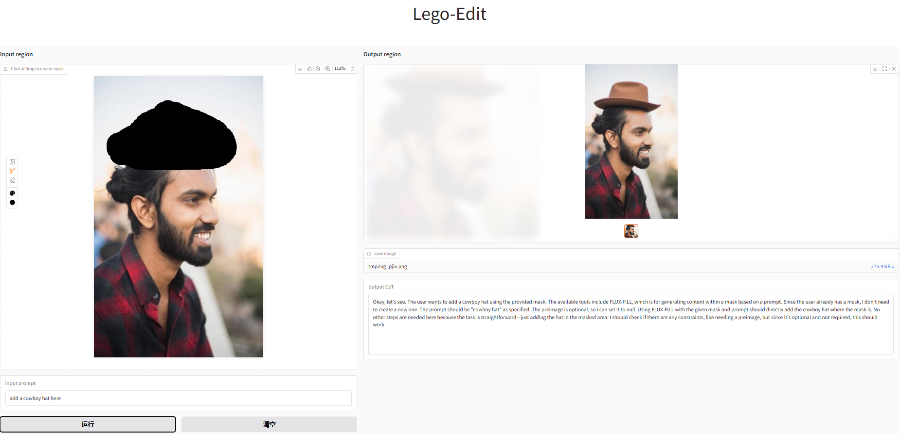
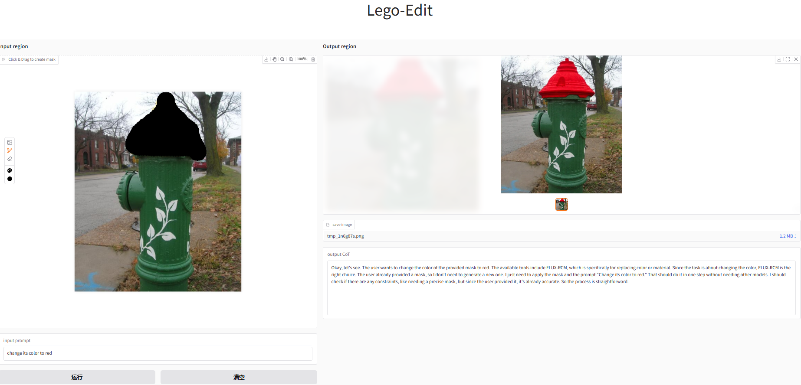
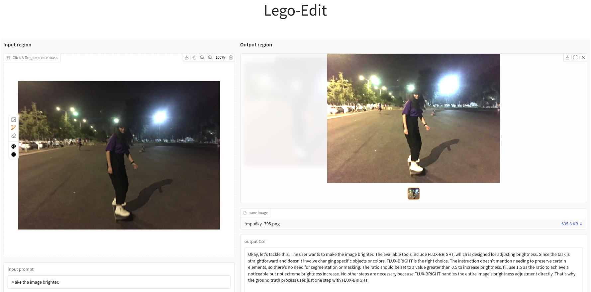
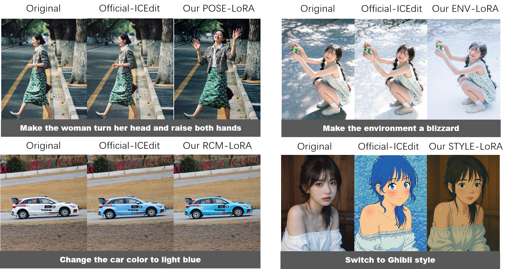

<p align="center">
  
</p>

<p align="center">
  <a href="https://xiaomi-research.github.io/lego-edit/">
    
  </a>
  <a href="https://arxiv.org/abs/2509.12883">
    
  </a>
  <a href="https://huggingface.co/xiaomi-research/lego-edit">
    
  </a>
  <a href="https://editdemo.ai.xiaomi.net/">
    
  </a>
</p>

# Lego-Edit: A General Image Editing Framework with Model-Level Bricks and MLLM Builder
> Qifei Jia, Yajie Chai, Xintong Yao, Qiming Lu, Yasen Zhang<sup>+</sup>, Runyu Shi, Ying Huang, Guoquan Zhang

> contact: jiaqifei1@xiaomi.com

> Instruction-based image editing has garnered significant attention due to its direct interaction with users. However, real-world user instructions are immensely diverse, and existing methods often fail to generalize effectively to instructions outside their training domain, limiting their practical application. To address this, we propose Lego-Edit, which leverages the generalization capability of Multi-modal Large Language Model (MLLM) to organize a suite of model-level editing tools to tackle this challenge. Lego-Edit incorporates two key designs: (1) a model-level toolkit comprising diverse models efficiently trained on limited data and image manipulation functions, enabling fine-grained composition of editing actions by the MLLM; and (2) a three-stage progressive reinforcement learning approach that uses feedback on unannotated, open-domain instructions to train the MLLM, equipping it with generalized reasoning capabilities for handling real-world instructions. Experiments demonstrate that Lego-Edit achieves state-of-the-art performance on GEdit-Bench
and ImgBench. It exhibits robust reasoning capabilities for open-domain instructions and can utilize newly introduced editing tools without additional fine-tuning. 
The figure below showcases Lego-Edit's qualitative performance.

<p align="center"></p>

## ✨ Featrues

Lego-Edit supports local editing, global editing, and multi-step editing as demonstrated in our tests, with corresponding results shown above. We discuss its feedback responsiveness and tool-extension capabilities in our paper.

Additionally, Lego-Edit accepts mask inputs for precise editing region control. Example applications are provided here:

<p align="center"></p>

<p align="center"></p>

You can try it and find more usages of this framework.

## 📢 News

- **Sep 17, 2025:** We released the official [website](https://xiaomi-research.github.io/lego-edit/), [demo](https://editdemo.ai.xiaomi.net/), [model](https://huggingface.co/xiaomi-research/lego-edit), and [report](https://arxiv.org/abs/2509.12883) for Lego-Edit.


## 🔥 Quick Start

1️⃣  Set up environment
```bash
conda create -n legoedit python==3.11
conda activate legoedit
pip install -r ./requirements.txt
Install flash-attention (you can install the corresponding version of flash-attention at https://github.com/Dao-AILab/flash-attention/releases)
Modify ~/yourconda/envs/lego-edit/lib/python3.11/site-packages/transformers/modeling_utils.py, line 5105, map_location="meta" to map_location="cpu"
```

2️⃣  Download pretrained checkpoint and custom nodes

Custom Nodes:
```bash
cd custom_nodes
git clone https://github.com/chflame163/ComfyUI_LayerStyle.git
git clone https://github.com/Fannovel16/comfyui_controlnet_aux.git
```

Base Model: 

1. Download the [FLUX.1-Fill-dev](https://huggingface.co/black-forest-labs/FLUX.1-Fill-dev/blob/main/flux1-fill-dev.safetensors) and [FLUX.1-Canny-dev](https://huggingface.co/black-forest-labs/FLUX.1-Canny-dev/blob/main/flux1-canny-dev.safetensors) and copy them to './models/unet/'.

2. Download the [vae](https://huggingface.co/black-forest-labs/FLUX.1-Fill-dev/blob/main/ae.safetensors) and copy it to './models/vae/'.

3. Download the [clip_l](https://huggingface.co/comfyanonymous/flux_text_encoders/blob/main/clip_l.safetensors) and [t5xxl](https://huggingface.co/comfyanonymous/flux_text_encoders/blob/main/t5xxl_fp8_e4m3fn.safetensors) and copy them to './models/clip/'.

4. Download the [lama](https://drive.google.com/file/d/11RbsVSav3O-fReBsPHBE1nn8kcFIMnKp/view?usp=drive_link), unzip and copy it to './lama'.


Our Model:

1. Download all the models (Builder, mimo_lora, CVSOS, CVRES, loras) from [lego-edit](https://huggingface.co/xiaomi-research/lego-edit/).


Your model structure should match the following:
```bash
├── README.md               
├── requirements.txt                      
├── legodemo.py                
├── Builder/                
├── mimo_lora/
├── models/                     
│   ├── unet/
│   ├── vae/              
│   ├── clip/         
│   └── loras/              
├── CVSOS/
├── CVRES/
├── lama/                     
│   ├── big-lama/  
```


3️⃣ Use Gradio WebUI to start playing with Lego-Edit!
```bash
python legodemo.py
```

## 💼 New Tools Integration

Our Lego-Edit supports the integration of new tools. You can follow the steps below to add custom tools, and The Builder will be able to use them during image editing.

1️⃣  Add the custom tools in system_prompt.txt

In system_prompt.txt, you can see many tools such as FASTINPAINT, FLUX-FILL, and more. You can add new tools to perform your desired editing tasks. For example, after the FLUX-POSE tool, you could define a new FLUX-SR tool to handle image super-resolution. In system_prompt.txt, you only need to add the model's description, inputs, outputs and constraints, as shown below:
```bash
...
10.FLUX-POSE (Change the object's posture, expression, etc.)
Input: {Image[image], Str[prompt]}
Output: {Image[image]}
Constraint: The input prompt must provide a detailed description of the external characteristics of the modification target, such as gender, clothing, accessories, etc and don't use any PREDICT model in advance.
11.FLUX-BRIGHT (Input image and ratio, adjust image brightness according to ratio)
Input: {Image[image], Float[ratio]}
Output: {Image[image]}
Constraint: The range of input ratio is > 0, where 0 represents the darkest, 0.5 represents it remains unchanged and > 0.5 represents the brighter.
**Actual example1:**
...
```


2️⃣  Add the tool function in legodemo.py

In the initialize_model_mapping function within legodemo.py, add the function name of your new tool.
```python
    def initialize_model_mapping(self) -> Dict[str, Any]:
        return {
            "CMI-PRED": self.dummy_captionmask_pred,
            "RES": self.dummy_res,
            "MASK-SEG": self.dummy_mask_seg,
            "FASTINPAINT": self.dummy_fastinpaint,
            "FLUX-FILL": self.dummy_flux_fill,
            "FLUX-INPAINT": self.dummy_flux_inpaint,
            "INVERSE": self.dummy_inverse,
            "COMPOSE": self.dummy_compose,
            "RESIZE": self.dummy_resize,
            "BBOX": self.dummy_bbox,
            "SOS": self.dummy_sos,
            "FLUX-CBG": self.dummy_flux_cbg,
            "ADD-PRED": self.dummy_add_pred,
            "FLUX-STYLE": self.dummy_flux_style,
            "FLUX-RCM": self.dummy_flux_rcm,
            "FLUX-ENV": self.dummy_flux_env,
            "FLUX-POSE": self.dummy_flux_pose,
            "FLUX-BRIGHT": self.dummy_flux_bright
        }
```

Complete your function (dummy_flux_sr) in legodemo.py.
```python
    def dummy_flux_bright(self, inputs: Dict[str, DataObject]) -> Dict[str, DataObject]:
        image_ori = inputs['image'].copy()
        ratio = inputs['ratio']
        input_value = max(0.0, min(1.0, ratio))
        ratio = 2 * input_value
        image_pil = Image.fromarray(image_ori[:,:,::-1])  
        enhancer = ImageEnhance.Brightness(image_pil)
        image_new = enhancer.enhance(ratio)
        image_new = np.array(image_new)[:,:,::-1]
        return {
            "image": image_new
        }
```

3️⃣ Restart Gradio WebUI

<p align="center"></p>


## 📍 More Usages

Some editing models are trained at a resolution of 768 via the ICEdit method, prioritizing higher output quality over the standard 512 resolution. We provide the corresponding trained [Single-Task-LoRA](https://huggingface.co/xiaomi-research/lego-edit/tree/main/loras). Based on our testing, these models deliver superior performance within their specific functional domains.

<p align="center"></p>

You can refer to the usage instructions at [ICEdit](https://github.com/River-Zhang/ICEdit) to use these LoRAs independently.


## 📄 Disclaimer

We open-source this project for academic research. The vast majority of images 
used in this project are either generated or licensed. If you have any concerns, 
please contact us, and we will promptly remove any inappropriate content. 
Our code is released under the Apache 2.0 License,, while our models are under 
the CC BY-NC 4.0 License. Any models related to <a href="https://huggingface.co/black-forest-labs/FLUX.1-dev" target="_blank">FLUX.1-dev</a> 
base model must adhere to the original licensing terms.
<br><br>This research aims to advance the field of generative AI. Users are free to 
create images using this tool, provided they comply with local laws and exercise 
responsible usage. The developers are not liable for any misuse of the tool by users.

## ✍️ Citation

If this repo is helpful, please help to ⭐ it.

If you find this project useful for your research, please consider citing our paper:

```bibtex
@article{xxx,
  title   = {Lego-Edit: A General Image Editing Framework with Model-Level Bricks and MLLM Builder},
  author  = {xxx},
  journal = {xxx},
  year    = {2025}
}
```

## 🙏 Acknowledgments

- Built on the [MiMo-VL](https://github.com/XiaomiMiMo/MiMo-VL), [ComfyUI](https://github.com/comfyanonymous/ComfyUI), [FLUX](https://github.com/black-forest-labs/flux), [ICEdit](https://github.com/River-Zhang/ICEdit), [EVF-SAM](https://github.com/hustvl/EVF-SAM) and [LaMa](https://github.com/advimman/lama)

