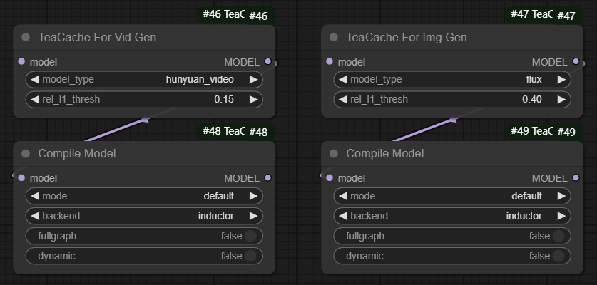

# ComfyUI-TeaCache

## Introduction
Timestep Embedding Aware Cache ([TeaCache](https://github.com/ali-vilab/TeaCache)) is a training-free caching approach that estimates and leverages the fluctuating differences among model outputs across timesteps, thereby accelerating the inference. TeaCache works well for Image Diffusion models, Video Diffusion Models, and Audio Diffusion Models.

TeaCache has now been integrated into ComfyUI and is compatible with the ComfyUI native nodes. ComfyUI-TeaCache is easy to use, simply connect the TeaCache node with the ComfyUI native nodes for seamless usage.

## Updates
- Jan 17 2025: ComfyUI-TeaCache supports CogVideoX:
    - It can achieve a 1.5x lossless speedup and a 2x speedup without much visual quality degradation.
    - Support Text to Video and Image to Video!
    - Note that TeaCache for CogVideoX node needs to be used with kijai's ComfyUI-CogVideoXWrapper nodes.
- Jan 15 2025: Thanks [@TangYanxin](https://github.com/TangYanxin), ComfyUI-TeaCache supports PuLID-FLUX and fixes bug about rel_l1_thresh:
    - It can achieve a 1.2x lossless speedup and a 1.7x speedup without much visual quality degradation.
    - Fixes a bug about rel_l1_thresh, when there are multiple TeaCache nodes in a workflow, the rel_l1_thresh value is always the value of the last TeaCache node.
- Jan 14 2025: ComfyUI-TeaCache supports Compile Model and fixes a bug that TeaCache keeps forever even if we remove/bypass the node:
    - Support Compile Model, now it can bring a faster inference when you add Compile Model node!
    - Fixes a bug related to usability, now we can go back to the workflow state without TeaCache if we remove/bypass TeaCache node.
- Jan 13 2025: Thanks [@TangYanxin](https://github.com/TangYanxin), ComfyUI-TeaCache remove the Steps setting from the node:
    - Now, it works fine even if there are multiple sampling nodes with different sampling steps in the workflow.
    - Fixes a bug, RuntimeError: The size of tensor a must match the size of tensor b at non-singleton dimension.
- Jan 10 2025: ComfyUI-TeaCache supports LTX-Video:
    - It can achieve a 1.4x lossless speedup and a 1.7x speedup without much visual quality degradation.
    - Support Text to Video and Image to Video!
- Jan 9 2025: ComfyUI-TeaCache supports HunyuanVideo:
    - It can achieve a 1.6x lossless speedup and a 2x speedup without much visual quality degradation.
- Jan 8 2025: ComfyUI-TeaCache supports FLUX:
    - It can achieve a 1.4x lossless speedup and a 2x speedup without much visual quality degradation.
    - Support FLUX LoRA!
    - Support FLUX ControlNet!

## Installation
Installation via ComfyUI-Manager is preferred. Simply search for ComfyUI-TeaCache in the list of nodes and click install.
### Manual installation
1. Go to comfyUI custom_nodes folder, `ComfyUI/custom_nodes/`
2. git clone https://github.com/welltop-cn/ComfyUI-TeaCache.git
3. pip install -r requirements.txt

## Usage
### TeaCache
To use TeaCache node, simply add `TeaCache For Img Gen` or `TeaCache For Vid Gen` node to your workflow after `Load Diffusion Model` node or `Load LoRA` node (if you need LoRA). Generally, TeaCache can achieve a speedup of 1.5x to 3x with acceptable visual quality loss. The following table gives the recommended rel_l1_thresh ​for different models:

|                 |       FLUX        |     PuLID-FLUX     |     HunyuanVideo   |    LTX-Video    |    CogVideoX    |
|:---------------:|:-----------------:|:------------------:|:------------------:|:---------------:|:---------------:|
| rel_l1_thresh   |        0.4        |        0.4         |        0.15        |     0.06        |     0.3        |
|    speedup      |        ~2x        |        ~1.7x       |        ~2x         |     ~1.7x       |     ~2x       |

The demo workflows ([teacache_flux](./examples/teacache_flux.json), [teacache_pulid_flux](./examples/teacache_pulid_flux.json), [teacache_hunyuanvideo](./examples/teacache_hunyuanvideo.json), [teacache_ltx_video](./examples/teacache_ltx_video.json), [teacache_cogvideox](./examples/teacache_cogvideox.json)) are placed in examples folder.

### Compile Model
To use Compile Model node, simply add `Compile Model` node to your workflow after `Load Diffusion Model` node or `TeaCache` node. Compile Model uses `torch.compile` to enhance the model performance by compiling model into more efficient intermediate representations (IRs). This compilation process leverages backend compilers to generate optimized code, which can significantly speed up inference. The compilation may take long time when you run the workflow at first, but once it is compiled, inference is extremely fast. The usage is shown below:

## Result comparison
- 
<strong>FLUX</strong>

- 
<strong>PuLID-FLUX</strong>

- 
<strong>HunyuanVideo</strong>

https://github.com/user-attachments/assets/b3aca64d-c2ae-440c-a362-f3a7b6c633e0

- 
<strong>LTX-Video</strong>

https://github.com/user-attachments/assets/8fce9b48-2243-46f1-b411-80e4a53f6f7d

- 
<strong>CogVideoX</strong>

https://github.com/user-attachments/assets/de8f5400-e885-446d-936f-c026a78ba5c2

## Acknowledgments
Thanks to TeaCache repo owner [ali-vilab/TeaCache: Timestep Embedding Tells: It's Time to Cache for Video Diffusion Model](https://github.com/ali-vilab/TeaCache)
